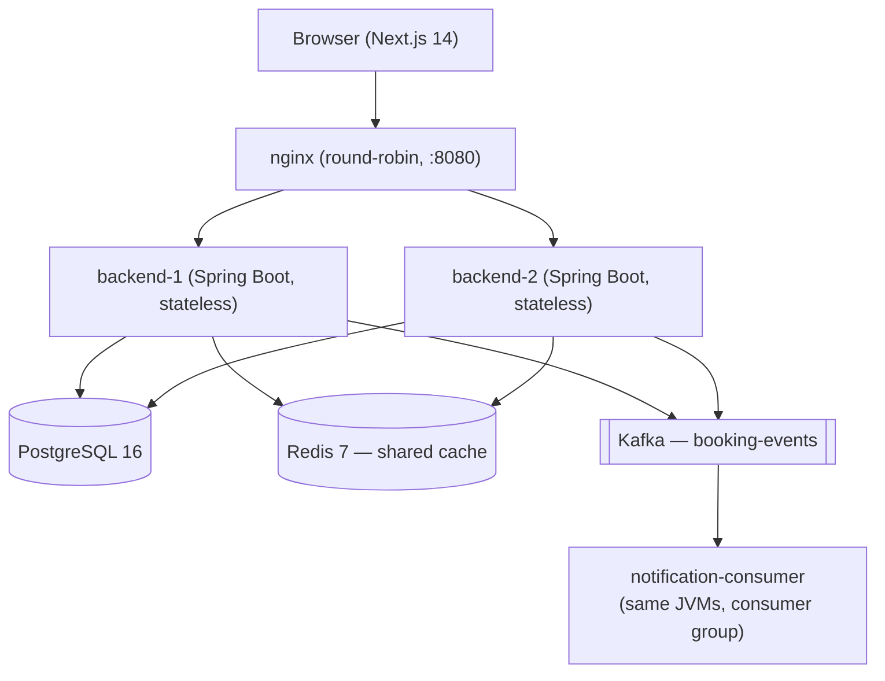

# TripBook

A flight & hotel booking platform built to explore the engineering problems
real booking systems face: concurrent seat/room inventory under contention,
cache correctness across multiple instances, horizontal scaling, and
event-driven side effects that must never block the user or get lost.

Built as a 4-week project for a Software Engineer Intern application at
Tiket.com. Everything below is either backed by real captured evidence
(commands and their actual output) or explicitly marked as not yet done —
nothing here is aspirational.

## Architecture



## Tech stack

| Layer | Choice | Why |
|---|---|---|
| Backend | Java 17, Spring Boot 3.5, Maven | Mainstream, well-documented stack for the target role |
| Security | Spring Security + JWT (jjwt) | Stateless auth is what makes round-robin load balancing possible with zero sticky-session hacks |
| Persistence | Spring Data JPA + Flyway | Flyway owns the schema (`ddl-auto=validate`) — no silent drift between entities and the real database |
| Database | PostgreSQL 16 | `SELECT ... FOR UPDATE` gives real pessimistic row locks, which is the whole point of Phase 4/7 |
| Cache | Redis 7 (Spring Data Redis) | Shared across instances — an in-process cache would let one instance serve stale availability after the other processes a booking |
| Broker | Kafka | Decouples "booking succeeded" from "notification sent"; survives a broker outage without failing the booking |
| Load balancer | nginx | Round-robin (not `ip_hash`) on purpose — sticky sessions would hide a statelessness bug instead of proving its absence |
| Frontend | Next.js 14 (App Router), TypeScript, Tailwind, Framer Motion | Server components for data fetching, client components only where interaction requires it |
| Testing | JUnit 5, Mockito, AssertJ, JaCoCo | See [Phase 13 evidence](#tests) below |

**Explicitly out of scope** (conscious decisions, not gaps nobody noticed):
3D seat rendering, a real payment gateway, ElasticSearch/MongoDB/Cassandra,
Kubernetes, multi-region deployment. See [Scope and limitations](#scope-and-limitations).

## Engineering decisions

**1. Pessimistic locking over optimistic locking for seat/room inventory.**
The contended resource is a specific seat or room, and near a sold-out
flight many concurrent requests target the *same* row. Optimistic locking
would mean most of those requests fail with a version conflict and have to
retry — under heavy contention that's a retry storm, not a fix. A
`PESSIMISTIC_WRITE` lock (`SELECT ... FOR UPDATE`, 3s timeout) serializes
access to that one row directly at the database level; everyone else either
waits briefly or gets a clean 409, once, without retrying.

**2. Database-level locking, never Java `synchronized`.** `synchronized`
only guarantees mutual exclusion within a single JVM. The moment there are
two backend instances behind nginx (Phase 6), a `synchronized` block on
one instance does nothing to stop the other instance from booking the same
seat at the same time. The lock has to live somewhere both instances share
— the database row itself.

**3. Redis over an in-process cache.** Same reasoning as above, applied to
caching: `ConcurrentMapCacheManager` or Caffeine would cache locally per
JVM. After backend-2 processes a booking, backend-1's local cache would
keep serving the old (now wrong) available-seats count until its TTL
expired — a real correctness bug, not just a performance one. Redis is
external and shared, so a booking through either instance evicts the cache
both instances read from.

**4. JWT over server-side sessions.** A session needs somewhere to live —
either sticky routing back to the instance that created it, or a shared
session store. JWT carries the identity in the request itself, so either
instance can validate it independently with zero shared state. The cost:
no instant revocation — a compromised token is valid until it expires
(24h here). A production system would pair this with a short-lived access
token + refresh token, or a revocation list in Redis; out of scope for this
project's timeline.

**5. Kafka publish is `AFTER_COMMIT` and non-blocking.** The producer runs
in a `@TransactionalEventListener(phase = AFTER_COMMIT)` handler, so an
event is only ever published for a booking that actually committed — never
one that later rolled back. It's also `@Async`, so the HTTP response
returns the moment the booking transaction commits, without waiting for
Kafka to accept the message. Verified directly: stopping the Kafka
container entirely and booking a seat still returns 201 with the row
persisted in Postgres; the publish failure is logged (not thrown to the
user) once the Kafka client's own retry/timeout gives up.

## Verified behavior

Real captured evidence, not claims:

- **Concurrency**: [`docs/concurrency-test-result.txt`](docs/concurrency-test-result.txt)
  — 4 runs of 50 simultaneous booking requests for one seat. Every run:
  exactly 1×201, 49×409, 0×500, exactly 1 booking row in the database. One
  run used only a single backend instance (backend-2 stopped) and held the
  same guarantee.
- **Load balancing**: 10 consecutive `curl /api/health` calls through nginx
  return `X-Instance-Id: backend-1`/`backend-2` alternately (round-robin,
  no `ip_hash`).
- **Statelessness across instances**: a JWT issued by backend-1 authenticates
  successfully against backend-2 with no shared session state.
- **Shared cache correctness**: a flight search served by backend-2
  immediately reflects a booking made through backend-1 (availableSeats
  count changes) with zero additional SQL query on the second instance —
  confirmed via `org.hibernate.SQL` debug logging.
- **Failover**: stopping backend-2 mid-traffic, all subsequent requests
  through nginx still return 200 from backend-1.
- **Kafka outage resilience**: booking succeeds (201, row persisted) with
  the Kafka container stopped; the publish failure is logged roughly
  75–120s later (the Kafka client's own `delivery.timeout.ms`), never
  surfaced to the caller.
- **No duplicate notification processing**: both backend instances run the
  same Kafka consumer group (`notification-service`); 5 bookings produce
  exactly 5 `[NOTIFICATION]` log lines total across both instances, not 10.

## Tests

`./mvnw test` (backend): **21 tests, 0 failures, 0 errors** — includes the
Spring context load test plus unit tests for `BookingService` (locking,
conflict handling, ownership, event publishing) and `JwtService`
(generation, expiry, tamper detection, claim round-trip).

The `BookingService` tests are proven to actually catch a regression, not
just decorate the class: the locking call was temporarily swapped for a
plain `findById` and the suite re-run — 5 of 10 tests failed as expected,
then it was reverted and confirmed green again.

Coverage (JaCoCo, line coverage): **`JwtService` 100%**, **`BookingService`
87.7%**. Honestly not covered: `getMyBookings`/`getMyBooking` (no test
written for the plain read paths) and the hotel-room-release branch of
`cancel()` (only the flight-seat branch is exercised).

`FlightService`/`HotelService` search validation (past dates, `checkOut`
after `checkIn`, positive passenger/guest counts) has unit tests too. The
aggregate search query itself isn't Mockito-tested — it runs native SQL
directly via `EntityManager`, and mocking that chain would only prove the
right methods were called, not that sorting or `availableSeats` are
actually correct. That's verified against real Postgres data in the Phase 3
audit instead (curl-tested: `sort=price_asc` returns ascending prices).

Testcontainers integration tests (a real Postgres, full booking flow
through the service layer, a concurrent double-booking test at the
integration level) were **not written** — the plan marks this "only if time
allows," and the Phase 7 load-test script already proves the same
concurrency guarantee end-to-end against the real stack, which is the
scenario that mattered most here.

## API documentation

Every endpoint is documented live via springdoc-openapi, generated from the
actual controllers (so it can't drift from the real API):

```bash
open http://localhost:8080/swagger-ui/index.html
```

17 endpoints across auth, flights, hotels, bookings, admin flight/hotel
CRUD, and health.

## Setup

Requires Docker. The backend needs a JDK 17 to run `./mvnw` directly, or
run it inside a container (this repo was developed on a machine with no
host JDK — see the compile/run pattern below).

```bash
# 1. start everything (Postgres, Redis, Kafka+Zookeeper, 2 backend
#    instances, nginx). Seed data (15 flights, 12 hotels) is applied
#    automatically via Flyway on first boot.
cd infra
docker compose up -d --build

# if 5432/6379 are already used by something else on your machine:
# TRIPBOOK_DB_PORT=5433 TRIPBOOK_REDIS_PORT=6380 docker compose up -d --build

# 2. confirm it's up (through nginx, not a backend instance directly)
curl -i http://localhost:8080/api/health

# 3. frontend
cd ../frontend
npm install
npm run dev
# -> http://localhost:3000
```

Without a host JDK, compile/test the backend via Docker instead of `./mvnw`:

```bash
docker run --rm -v "$PWD/backend":/app -v tripbook-m2:/root/.m2 -w /app \
  maven:3.9-eclipse-temurin-17 mvn test
```

Default URLs once running:

| What | URL |
|---|---|
| App (through nginx) | http://localhost:8080 |
| Swagger UI | http://localhost:8080/swagger-ui/index.html |
| Frontend | http://localhost:3000 |

## Scope and limitations

Stated plainly, not buried:

- **No real payment gateway.** Bookings go straight to `CONFIRMED` —
  there's no payment step to fail or reconcile.
- **No 3D seat rendering.** A deliberate choice to spend the time budget on
  backend concurrency/scaling depth instead of a rarely-load-bearing visual
  feature.
- **No ElasticSearch/MongoDB/Cassandra.** Postgres is sufficient at this
  scale (15 flights, 12 hotels, a few hundred seats/rooms); ElasticSearch
  would be the natural next step if full-text destination search became a
  real requirement.
- **No Kubernetes or multi-region deploy.** nginx + 2 local instances
  demonstrates the statelessness/scaling concept; it isn't a production
  topology.
- **Passenger/guest name is accepted but not persisted.** The booking
  request DTOs validate `passengerName`/`guestName` (matching the plan's
  literal API spec), but the `bookings` table (locked in during Phase 1) has
  no column for either. The frontend surfaces this honestly to the user
  rather than hiding it. Fixing it would mean a new Flyway migration —
  reasonable follow-up work, not done here.
- **JWT has no revocation.** A compromised token is valid until it expires
  (24h). See [Engineering decision #4](#engineering-decisions).
- **No Testcontainers integration tests.** See [Tests](#tests) above.
- Frontend intended for Vercel deployment; backend runs locally via Docker
  Compose only — no cloud deployment of the backend was set up.

## Honest gaps (said out loud, not hidden)

- Java and Spring Boot were new for this project — prior production
  experience is in PHP/Laravel and Node/TypeScript.
- This has not run at real scale. 2 instances on one machine is not 50
  million users; it proves the *mechanism* (statelessness, shared cache,
  DB-level locking), not production-scale throughput.
- ElasticSearch, Cassandra, and MongoDB are read-about, not shipped.

## Screenshots

Not committed as image files in this repo (nothing here was generated by
actually driving a browser and saving the output to disk — every visual
claim above was verified interactively but not captured as a binary
artifact). To see the real UI: `npm run dev` in `frontend/` and visit
`http://localhost:3000` — the landing page, `/search`, a flight's seat map
(`/flights/{id}`), and `/bookings` are the pages worth looking at.

## Repository layout

```
tripbook/
  backend/      Spring Boot 3.5 app (Java 17, Maven)
  frontend/     Next.js 14 app
  infra/        docker-compose.yml + nginx/
  docs/         ARCHITECTURE.md + captured evidence (concurrency-test-result.txt)
  scripts/      concurrency-test.sh (Phase 7 load test)
  PLAN.md       the phased build plan this project followed
```

See [`docs/ARCHITECTURE.md`](docs/ARCHITECTURE.md) for the booking sequence
diagram and a deeper look at failure modes considered.
