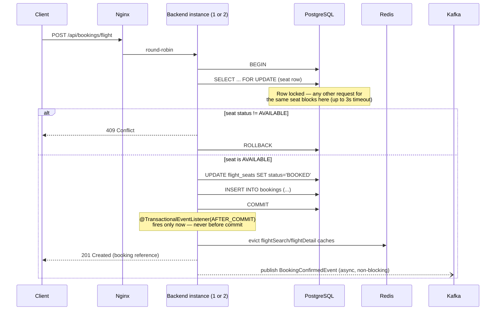

# Architecture

Deeper detail on the booking sequence and the failure modes considered while
building it. See [`README.md`](../README.md) for the system-level overview,
tech stack rationale, and verified-behavior evidence.

## Booking sequence (flight)

The two branches matter for different reasons:

- The **409 branch** proves the lock is real, not an application-level
  check-then-act race: `PESSIMISTIC_WRITE` means the row is physically
  locked in Postgres from the `SELECT ... FOR UPDATE` until the transaction
  ends, so a second request for the same seat cannot even read a stale
  "AVAILABLE" status — it queues behind the first transaction.
- The **Kafka publish** happens *after* `COMMIT` and off the request
  thread. If it happened before commit and the transaction later rolled
  back, a notification would go out for a booking that doesn't exist. If it
  blocked the request thread, a slow or down broker would make bookings
  slow or fail for a reason that has nothing to do with seat availability.

## Failure modes considered

**A seat lock times out (3s) instead of hanging forever.** Without a lock
timeout, one stuck transaction (a slow query, a connection pool exhausted
elsewhere) could block every subsequent request for that seat indefinitely.
The `jakarta.persistence.lock.timeout` hint bounds that: a request either
gets the lock promptly or fails cleanly, rather than hanging the caller.

**One backend instance goes down mid-traffic.** nginx's
`proxy_next_upstream error timeout http_502 http_503 http_504` retries a
failed request against the other upstream automatically. Verified: stopping
`backend-2` mid-traffic, all subsequent requests through nginx keep
returning 200 from `backend-1` with no client-visible failure.

**The Kafka broker is down when a booking is made.** The booking must not
fail because of it — notification delivery is a side effect, not part of
the booking's correctness. `@Async` + `@TransactionalEventListener` means
the HTTP response already returned before the publish attempt even starts.
Verified: stopping the Kafka container entirely, a booking still returns
201 with the row persisted in Postgres; the publish failure surfaces only
in the backend's own logs (`BookingEventPublisher`'s `whenComplete`
callback), roughly 75–120 seconds later once the Kafka client's own
`delivery.timeout.ms` gives up retrying internally — never thrown to the
caller.

**A Kafka consumer processes the same event twice.** Both backend instances
run `@KafkaListener` in the same consumer group (`notification-service`),
so Kafka partitions the `booking-events` topic between them — each event is
delivered to exactly one consumer instance, not both. Verified: 5 bookings
produce exactly 5 `[NOTIFICATION]` log lines total across both instances
combined, not 10.

**A consumer throws while processing an event.** `DefaultErrorHandler` with
a `FixedBackOff` retries 3 times (500ms apart), then writes the event to a
`failed_events` table (`V3__failed_events.sql`) instead of dropping it
silently — the payload and error message are preserved for manual recovery
rather than being lost.

**Two instances serve stale cached availability.** Covered in
[README's Engineering decision #3](../README.md#engineering-decisions) —
the short version: any write path that changes seat/room availability
(`bookFlight`, `bookHotel`, `cancel`, and the admin CRUD endpoints) carries
`@CacheEvict` on the relevant cache names, so the next read on *either*
instance re-populates from the database rather than serving a stale value
from its own (nonexistent, since it's Redis-backed) local cache.

**A double-click fires the same mutation twice.** Not specifically guarded
against at the API level beyond the seat/room lock itself — a double-booking
attempt for the *same* seat is still serialized by the same
`PESSIMISTIC_WRITE` lock and the second attempt gets a clean 409. The
frontend additionally disables the confirm button while a request is in
flight as a first line of defense, but the real correctness guarantee is
the database lock, not the UI debounce.

## What isn't modeled

- **Per-date inventory calendars.** `flight_seats`/`hotel_rooms` track a
  single `AVAILABLE`/`BOOKED` status, not a per-night/per-date availability
  window. A hotel room is either bookable or not *right now* — there's no
  concept of "available Aug 1–3 but booked Aug 4–5." Modeling that properly
  would need a separate availability-calendar table keyed by date range,
  which is out of scope for this project's timeline (see
  [README's Scope and limitations](../README.md#scope-and-limitations)).
- **Exactly-once Kafka delivery.** The consumer group setup gives
  at-least-once delivery in the normal case (each event processed by
  exactly one instance) but doesn't implement idempotency keys at the
  consumer level — a redelivery after a consumer crash mid-processing
  (before committing its offset) could in principle log a duplicate
  notification. Acceptable here since the consumer only logs a simulated
  email send; would need an idempotency check (e.g. a processed-events
  table keyed by booking reference) if the side effect were something with
  a real-world cost to repeat.
